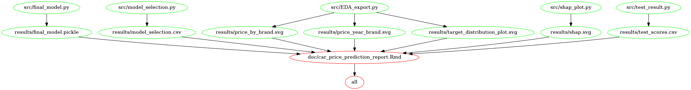

# Used Car Price Prediction

-   Author: Amelia Tang 

## About

It is attractive, at times, for us to buy used cars. The price and insurance cost of a used car is generally lower than a new one (Caldwell 2021). People who consider buying second-hand cars may want to know the reasonable prices and get more information on what factors contribute to the prices of used cars. Therefore, I built a regression model to predict the price of used cars using features relevant to evaluate the quality of used cars, such as the brand, model, year built, the size of the engine and the type of fuel used. I experimented on four popular algorithms for regression problems: linear regression with L2 regularization (`ridge`), linear regression with L1 regularization (`lasso`), `random forest` and `XGBoost`. I also utilized scikit-learn's `DummyRegressor` as a base case for comparison. After comparing the performances, I selected `XGBoost` as the best algorithm and conducted hyperparameter tuning. The tuned XGBoost model achieved an R-squared of 95.8%. 

The data set used in this project was a subset of the `100,000 UK Used Car Data set` on kaggle.com and available [here](https://www.kaggle.com/kukuroo3/used-car-price-dataset-competition-format). Each row of the data represents a used car and provides its ID, brand, model, year, transmission, mileage, fuel type, tax, miles per gallon and engine size. 

## Report

The final report can be found [here](https://htmlpreview.github.io/?https://github.com/aimee0317/car_price_prediction/blob/main/doc/car_price_prediction_report.html).

## Model Deployment 

 **Heroku**: https://used-car-price-prediction-at.herokuapp.com/ (NOTE: Link disabled because Heroku no longer offers a free tier plan in 2023. See the deployment files in https://github.com/aimee0317/car_price_prediction/tree/main/deployment/Heroku)
 **Microsoft Azure**: https://car-price-prediction.azurewebsites.net/
(Azure deployment Github repository: https://github.com/aimee0317/car_price_azure_deployment)
 Demo on the Flask app deployed on Azure

## Usage

### Creating the environment

`conda env create --file car_price.yml`

Run the following command from the environment where you installed
JupyterLab.

`conda install nb_conda_kernels`

#### Chart Saving Using Altair 5.0 Version
As of July 12, 2023, `altair_saver` does not yet support Altair 5. To save charts/plots created by Atair 5.0 in PNG and SVG formats and if you are a non-Apple Silicon computer user, you need to install the `vl-convert` package:
 `conda install -c conda-forge vl-convert-python`
 or 
 `pip install vl-convert-python`
  As of July 12, 2023, `vl-convert` does not support Apple Silicon architecture. To read more about saving Atlair charts/plots, please see the official documentation [here](https://altair-viz.github.io/user_guide/saving_charts.html).

### To replicate the analysis
Clone this Github repository, install the dependencies, and run the 
following commands at the command line/terminal from the root directory of the project:

    make all

To reset the repo to the original state, and delete all results files
and report, run the following commands at the command line/terminal from
the root directory of the project:

    make clean

Note: Due to the recent frequent update of the Altair package, I no longer include saving the EDA graphs/plots in the makefile. This part of the analysis is not reproducible using this makefile. 

## Dependencies

A complete list of dependencies is available [here](https://github.com/aimee0317/car_price_prediction/blob/main/car_price.yml).
 - Python 3.10.12 and Python packages:  - docopt=0.6.2  -
altair=4.2.0  - altair_data_server=0.4.1  - scikit-learn=1.3.0  - xgboost=1.7.1

## Replicating the analysis using Docker
If you would like to replicate the analysis using Docker, follow the steps below:

From the root of this project, run the following command to replicate the analysis:

`docker-compose run --rm report-env make -C //home//xxx//work all`

To reset the project to the original state, and delete all result files and report, 
run the following command:

`docker-compose run --rm report-env make -C //home//xxx//work clean`

## Makefile dependency diagram 

## References 
Caldwell, Miriam. 2021. Buying a New Car Vs. Buying a Used Car: Which Should You Choose? the balance. https://www.thebalance.com/buying-a-new-car-or-used-car-2385961.

Harris, Charles R., K. Jarrod Millman, Stéfan J van der Walt, Ralf Gommers, Pauli Virtanen, David Cournapeau, Eric Wieser, et al. 2020. “Array Programming with NumPy.” Nature 585: 357–62. https://doi.org/10.1038/s41586-020-2649-2.

McKinney, Wes et al. 2010. “Data Structures for Statistical Computing in Python.” In Proceedings of the 9th Python in Science Conference, 445:51–56. Austin, TX.
Pedregosa, Fabian, Gaël Varoquaux, Alexandre Gramfort, Vincent Michel, Bertrand Thirion, Olivier Grisel, Mathieu Blondel, et al. 2011. “Scikit-Learn: Machine Learning in Python.” Journal of Machine Learning Research 12 (Oct): 2825–30.

Pudaruth, Sameerchand. 2014. “Predicting the Price of Used Cars Using Machine Learning Techniques.” Int. J. Inf. Comput. Technol 4 (7): 753–64.

Van Rossum, Guido, and Fred L. Drake. 2009. Python 3 Reference Manual. Scotts Valley, CA: CreateSpace.
